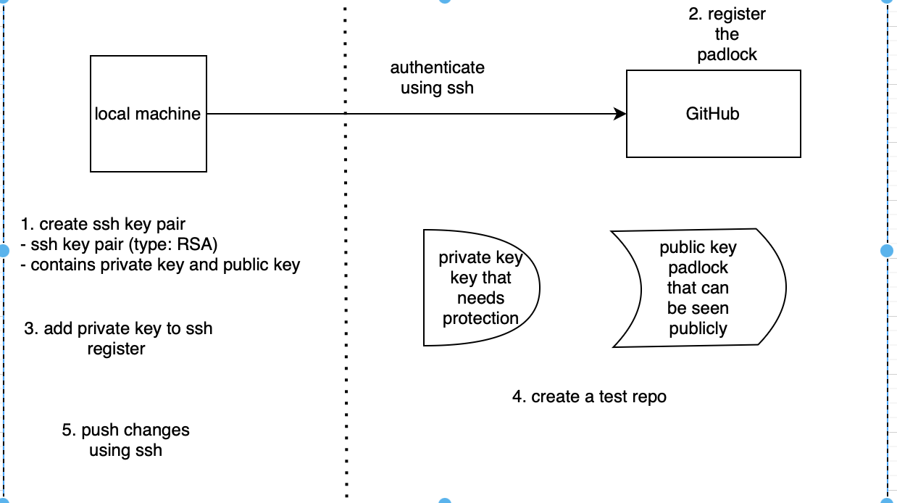
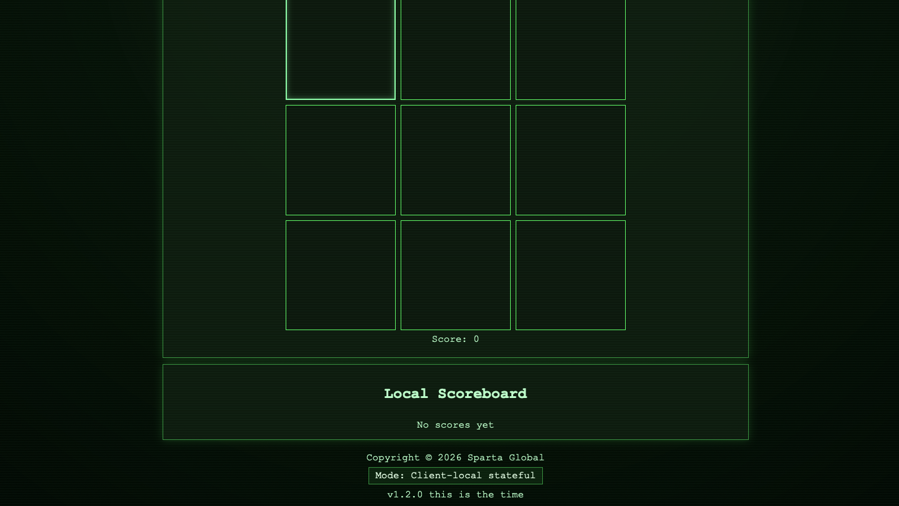
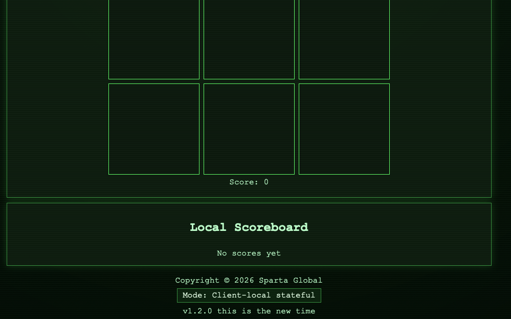

- [set up and test ssh push to github](#set-up-and-test-ssh-push-to-github)
  - [overview of how to setup](#overview-of-how-to-setup)
    - [generating ssh key for git hub](#generating-ssh-key-for-git-hub)
    - [register the padlock](#register-the-padlock)
    - [add private key to ssh register](#add-private-key-to-ssh-register)
    - [create a test repo](#create-a-test-repo)
  - [CICD pipeline with jenkins](#cicd-pipeline-with-jenkins)
    - [create a repo for app v1.2](#create-a-repo-for-app-v12)
  - [starting job 1 (test)](#starting-job-1-test)
    - [add a webhook](#add-a-webhook)
  - [job2: merge code](#job2-merge-code)
    - [example of using merge](#example-of-using-merge)
  - [job3](#job3)

# set up and test ssh push to github

## overview of how to setup

### generating ssh key for git hub
- cd into your ssh folder
- `ssh-keygen -t rsa -b 4096 -C "edwardtyler2002@gmail.com"` : using key rsa with 4096 bits
  - when prompted, enter 'edward-github-key'
  - asks for passphrase: press enter key
  - asks again: press enter key
- `ls` to see new folder containing ssh key

### register the padlock
- go to github -> profile -> ssh and gpg keys --> new ssh key
- name: 'edward-github-key'
- add the edward-github-key.pub to the description

### add private key to ssh register
- `eval 'ssh-agent -s'` : starts ssh agent in terminal and outputs private key
- `ssh-add edward-github-key` : adds private key to running ssh agent, uses key for authentication
- `ssh -T git@github.com` : tests your ssh connection to github
  - press yes to confirm

### create a test repo
- create a new repo with a readme (name: test_repo)
- move to github folder and use git clone
  - BUT! use the ssh link, not https
- edit the readme file and push it
- if push is successful, ssh github repo setup

## CICD pipeline with jenkins

### create a repo for app v1.2
- 'tech603-ttt-app-cicd-jenkins' : contains app folder with readme
- need to set up secure ssh deploy key
  - `ssh-keygen -t rsa -b 4096 -C "edwardtyler2002@gmail.com"` 
  - enter name of folder to keep private key
  - enter for passphrase
- go to settings in repo and deploy keys
  - add deploy key
  - give appropriate name 
  - copy public key into description
  - ALLOW READ/WRITE
  - sav key
  
## starting job 1 (test)
- log onto jenkins server -> new item
- enter item name -> click freestlye project -> ok
- configure page
  - give a description of your test
  - 'discard old builds' 
    - 'max # of builds to keep' = 5
  - click 'GitHub project'
    - provide url of HTTPS, REMOVE .GIT 
      - 'https://github.com/EdTyler-ui/tech603-ttt-app-cicd-jenkins/'
  - in 'source code management' -> press git
    - use ssh url for 'repository URL'
      - 'git@github.com:EdTyler-ui/tech603-ttt-app-cicd-jenkins.git'
    - now 'add' credentials
      - dropdown press jenkins
      - 'kind' : ssh username with private key
      - 'ID' : file name for private key (edward-jenkins-github-key)
      - 'Username' : same as ID
      - click private key and enter private key into text box (start with 5-, ends with 5-)
      - 'Passphrase' : leave blank
    - change brand specifier to 'dev' in branches to build
  - in build triggers
    - click 'GitHub hook trigger for GITScm polling'
  - build environment
    - click 'provide node and npm bin/folder to PATH'
  - build steps
    - execute shell
    - use following commands
      - cd app
      - npm ci
      - npm test
  - press save
- click 'build test'

### add a webhook
- go to webhooks in settings of repo in github
- 'add webhook'
- copy jenkins url
  - http://34.254.6.118:8080/github-webhook/
  - click add webhook

## job2: merge code

- click 'new item' -> give job2 a name -> 'freesytle project' -> ok
  - 'edward-job2-ci-merge'
- general settings:
  - 'discard old builds' 
    - 'max number of builds to keep' = 5
  - 'GitHub project' = add git repo https url and remove .git
    - 'https://github.com/EdTyler-ui/tech603-ttt-app-cicd-jenkins/'
- source code management
  - 'git'
    - 'repository url' : add ssh url for app repo 
      - git@github.com:EdTyler-ui/tech603-ttt-app-cicd-jenkins.git
    - 'add the credentials previously made:
      - 'edward-jenkins-2-github-key'
    - 'branch to build' : change the main to dev
      - '*/DEV'
- build triggers
  - click 'trigger builds remotely'
    - enter name of job1 (testing code)
- build environment
  - click 'provide Node and npm bin/folder to PATH' 
    - choose nodeJS version 20
- build steps:
  - execute shell here you can either use the shell to merge the cod using git
    - `git checkout dev` : after making changes to dev branch, checkout of it
    - `git merge main` : merge main with the dev branch
    - `git push origin main` : push the changes to the repo
  - or using git publisher plugin
    - in post build actions
      - archive the artifacts: 'app/**' 
        - this saves the results of this merge
    - in git publisher click
      - 'push only if build succeeds'
      - 'merge results'
      - 'force push'
    - add branch:
      - branch to push: main
      - target remote name: origin
- save and run

### example of using merge
- make change to file on the dev branch
  - `git switch dev` : swap to dev branch
  - `git status` : check if change has been noticed
  - `git add .` : stage the changes
  - `git commit -m 'change'` : commit the changes
  - `git push origin main` : push the commit to the main branch
- jenkins will carry out this merge
- refresh github page to see if changes have been made

## job3

- create a new project as usual with name
  - 'edward-job3-cd-deploy'
  - same discard old builds as job1,2
  - DO NOT CLICK 'GitHub project'
- source code management
  - none, we have app folder stored in jenkins folder from job2
- you can build a trigger 
  - once 'edward-job2-ci-merge' finishes
- since connection to an ec2 instance occurs, a private key is needed to be uploaded to jenkins
  - go to manage jenkins
  - credentials
  - press global
  - add new credential and add private key required for access to aws ec2 instances
- build environment:
  - 'ssh agent'
    - credentials -> find your aws private key 'tech603-edward-aws-key'
- build steps:
  - execute shell
    - `JOB2_FOLDER="/var/jenkins/workspace/edward-job2-ci-merge"` : locates app folder from job2
    - `ls -l` : displays file for debugging
    - `rsync -avz -e "ssh -o StrictHostKeyChecking=no" $JOB2_FOLDER/app/ ubuntu@54.247.240.154:/home/ubuntu/app/` : uses aws key, locates the app folder with the new changes in job2, uploads it to ec2 instance
      - make sure ec2 has dependencies installed
- start the app and observe the change made:
 - 
 - second change 4 minutes later when making change to app and pusing it
 - 
